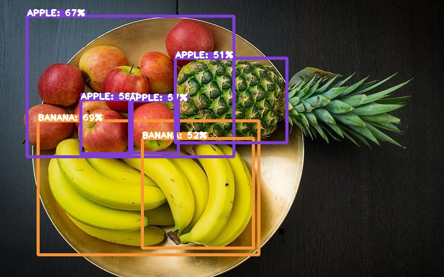

# Object Detection using TF2.x pre-trained model
Using pre-trained models from model zoo for object detection task.

## Quick start
#### Step 1: Clone repository or <a href="https://github.com/SarahHannes/tensorflow-object-detection/archive/refs/heads/main.zip">download zip</a>
```
!git clone https://github.com/SarahHannes/tensorflow-object-detection.git
```
#### Step 2: Select a model from <a href="https://github.com/tensorflow/models/blob/master/research/object_detection/g3doc/tf2_detection_zoo.md">Tensorflow 2 model zoo</a>

#### Step 3: Update selected `modelURL` in `main.py`
Right click the Model name from model zoo --> Copy link address --> Paste and save in `modelURL` variable

#### Step 4: Set confidence `threshold` level in `main.py` (optional)
Higher threshold means more objects will be missed by the model.

#### Step 5: Save images (.JPG) and videos (.MP4) for object detection under `/test` folder


## Output

| Original Image/ Video  | ResNet50 | MobileNetv2 |
| -----------------------| ------------- | ------------- |
|  |  |   |
|  |  |   |
|  |  |   |
|  |  |   |
|  |  |   |
|  |  |   |
|  |  |   |

## Credit
- <a href="https://www.youtube.com/watch?v=2yQqg_mXuPQ">TensorFlow Object Detection COMPLETE TUTORIAL | 40 TensorFlow Object Detection Models</a>
